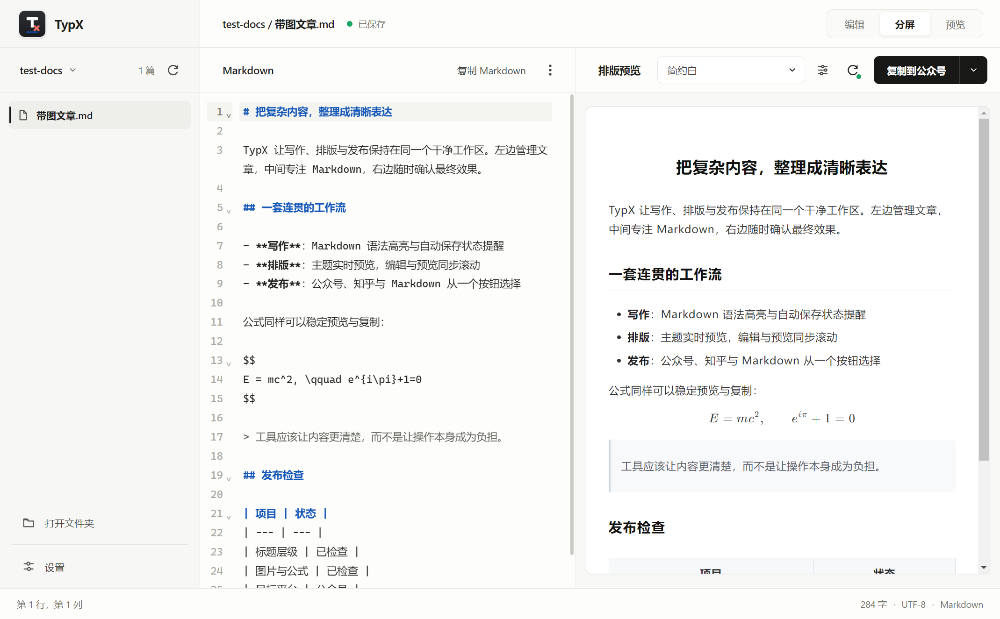
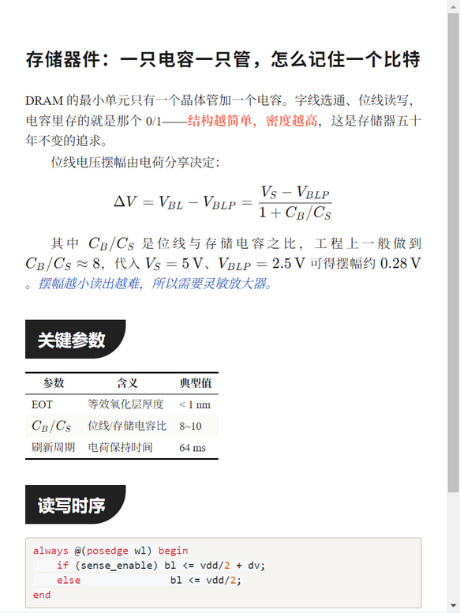
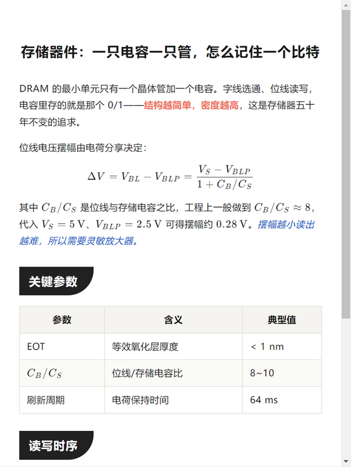
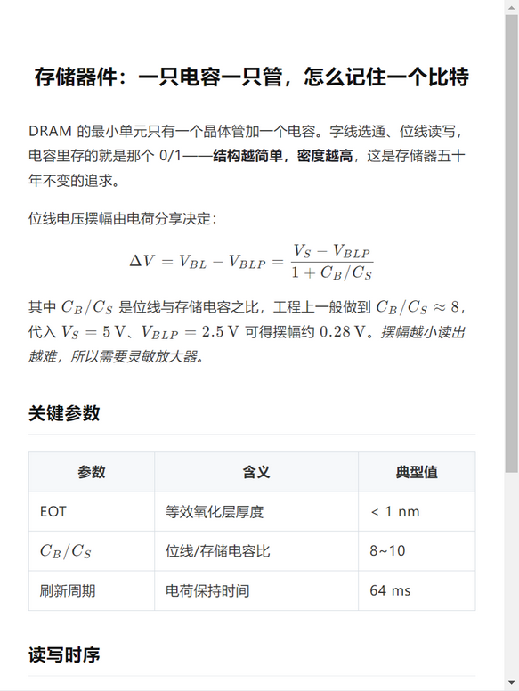
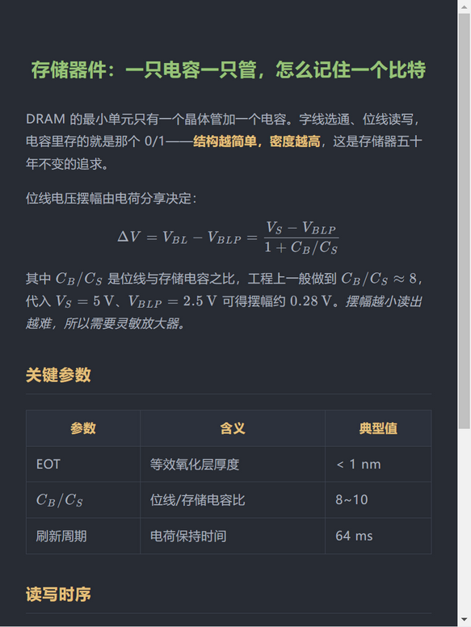

# TypX — Local-first Markdown Typesetter

[中文](README.zh-CN.md) | **English**

<p>
  
</p>

**Type Markdown in local folders, copy paste-ready articles to WeChat Official Account / Zhihu in one click.**

A local-folder edition of Markdown Nice (mdnice), built with Electron + TypeScript. Every file stays on your own computer — no servers involved.

📖 **[Full User Guide (中文)](docs/使用教程.md)** ｜ ⬇️ **[Download portable build](https://github.com/LuckyZ10/TypX/releases/latest)**

<br />

## UI



File tree on the left, Markdown editor in the middle, live themed preview on the right. Every folder you open is registered as a **project**; TypX restores the most recent project and the article you were editing on startup.

## Themes

7 built-in themes (Clean / Orange / Teal / Purple / Geek Dark / Ink Label / Ink Paper) plus custom CSS themes saved as your own.

<table>
  <tr>
    <td><br /><sub><b>Ink Paper 墨笺论文</b> — serif · first-line indent · justified · booktabs tables</sub></td>
    <td><br /><sub><b>Ink Label 墨青标签</b> — dark H2 tag blocks · coral bold · ink-blue italics</sub></td>
  </tr>
  <tr>
    <td><br /><sub><b>Clean 简约白</b> — minimal black & white</sub></td>
    <td><br /><sub><b>Geek Dark 极客黑</b> — dark code style</sub></td>
  </tr>
</table>

## Highlights

**✍️ Writing**

- **Projects**: opened folders are auto-registered; switch between projects, auto-restore your last article; external changes reload automatically
- **Three panes**: file tree (right-click to open in default app, reveal in Explorer, or flag as "published" with a green badge to avoid duplicate uploads) · CodeMirror 6 editor (Ctrl+S) · scroll-synced preview
- **View modes**: edit / split / preview — preview hides the Markdown source for distraction-free reading

**🎨 Typesetting**

- **7 themes + custom CSS**: copy inlines computed styles onto every element (the mdnice approach), so pasted content keeps its look without external stylesheets
- **Math**: KaTeX preview (`$...$` / `$$...$$`); formulas are converted to **inline SVG** when copying — the only reliable way to get math into the WeChat editor, even for articles with hundreds of formulas
- **Captions**: a standalone image followed by an all-italic line becomes a centered blue caption automatically
- **Footer links**: per-platform Markdown footer (e.g. WeChat album links) appended behind a divider on copy

**📤 Dual copy pipelines**

"Copy for WeChat" and "Copy for Zhihu" are two **independently configured** pipelines — tuning one never touches the other:

| | WeChat (battle-tested) | Zhihu (starter preset) |
| --- | --- | --- |
| Math | inline SVG | raw HTML |
| Images | base64 / optional image host | base64 |
| Footer | custom links | custom links |

- **Optional image hosting**: Gitee / GitHub / SM.MS, one-click test, content-hash naming with local cache

## Getting Started

**Portable build**: grab a zip from [Releases](https://github.com/LuckyZ10/TypX/releases/latest), unpack, run `TypX.exe`. Delete the folder to uninstall.

**From source**:

```bash
npm install
npm run dev        # build & launch
```

> If Electron download fails on CN networks: `ELECTRON_MIRROR=https://npmmirror.com/mirrors/electron/ npm install`

More commands: `npm run typecheck` / `npm run build` / `npm run dist:dir` (portable pack). See the [user guide](docs/使用教程.md) (Chinese) for details.

## Known Platform Limits

- WeChat filters base64 images and math HTML in pasted content — that's exactly why TypX converts math to SVG and offers optional image hosting
- Serif themes fall back to the phone's system serif; the look is largely preserved

## License

[PolyForm Noncommercial 1.0.0](LICENSE) — free for personal study, research and non-commercial use; commercial use requires separate permission.

## Credits

- The typesetting approach and WeChat-compatibility knowledge come from [mdnice](https://mdnice.com) and [doocs/md](https://github.com/doocs/md), especially ["Battling with the WeChat editor"](https://product.mdnice.com/article/intro/battle-with-wechat/) (the "WeChat accepts defs-free SVG math" finding)
- The "Ink Label / Ink Paper" themes originate from the Typlatex Article Ink stylesheet
- Built with [Electron](https://www.electronjs.org) · [esbuild](https://esbuild.github.io) · [CodeMirror 6](https://codemirror.net) · [marked](https://marked.js.org) · [KaTeX](https://katex.org) · [MathJax](https://www.mathjax.org) · [highlight.js](https://highlightjs.org) · [DOMPurify](https://github.com/cure53/DOMPurify)
