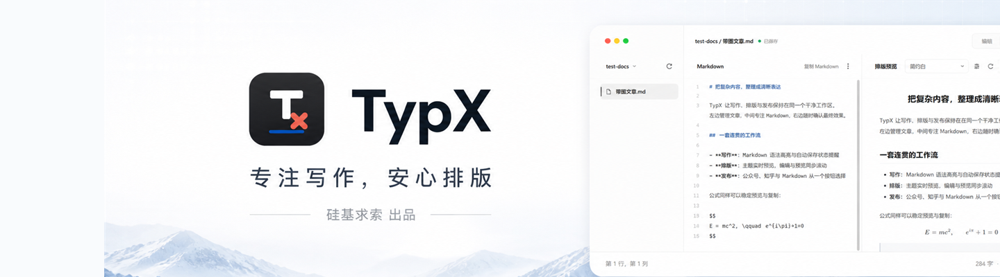
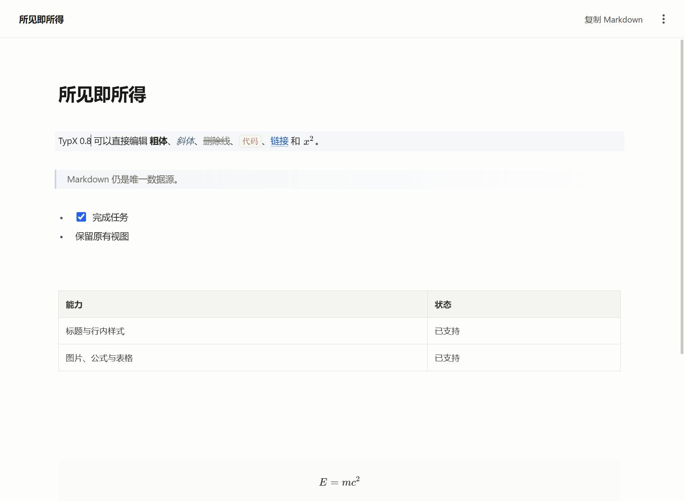
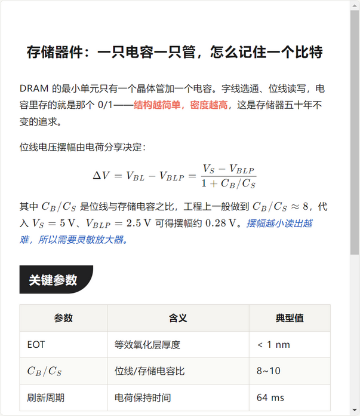
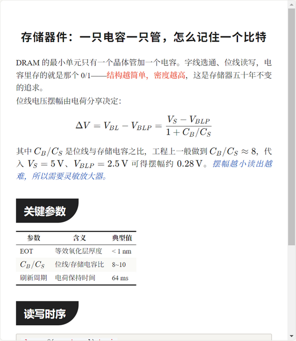
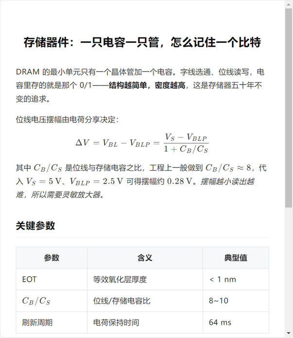
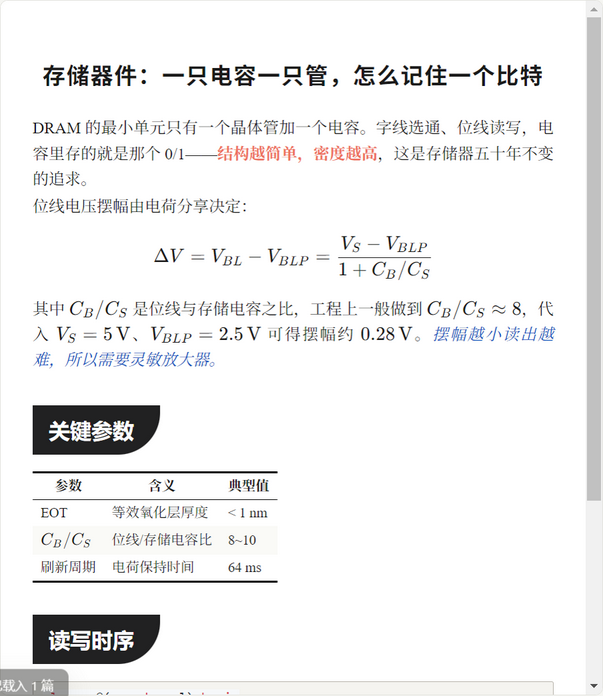

  

  <strong>本地优先的 Markdown 写作与公众号排版工具</strong> 
  <strong>A local-first Markdown editor and publishing tool for WeChat writers</strong>

  <a href="#中文">中文</a>
  &nbsp;·&nbsp;
  <a href="#english">English</a>

  
  
  
  
  
  

  <a href="https://github.com/LuckyZ10/TypX/releases/download/v0.8.0/TypX-Setup-0.8.0.exe"><strong>⬇️ 下载 Windows 安装包 / Download v0.8.0</strong></a>
  &nbsp;·&nbsp;
  <a href="https://github.com/LuckyZ10/TypX/releases">历史版本 / Releases</a>
  &nbsp;·&nbsp;
  <a href="https://github.com/LuckyZ10/TypX/issues">反馈 / Issues</a>

  

---

## 中文

### 一篇文章，从 Markdown 到发布

TypX 把本地文章管理、Markdown 编辑、所见即所得写作、主题预览和平台发布整理在同一个安静的工作区。文章始终保存在你自己的文件夹中，写完即可一键复制到微信公众号。

### ✍️ 所见即所得，写作不打断

标题、粗体、列表、待办、表格和公式，都可以直接在排版后的内容里编辑，接近 Typora 的手感。Markdown 始终是唯一数据源，"编辑 / 所见 / 分屏 / 预览"四种视图随时切换，不丢内容、不改文件。

  

### 🎨 多套排版主题，公式可靠呈现

内置多套为中文阅读打磨的排版主题，复制时主题样式直接内联进内容，粘贴到公众号编辑器即可保持版式。KaTeX 公式针对中文公式、`\text{}`、相邻行内公式与超长公式做了专项优化。

<table align="center">
  <tr>
    <td width="50%" align="center"> <b>简约白</b></td>
    <td width="50%" align="center"> <b>墨黑</b></td>
  </tr>
  <tr>
    <td width="50%" align="center"> <b>Geek</b></td>
    <td width="50%" align="center"> <b>纸墨</b></td>
  </tr>
</table>

### 📋 表格，像表格一样编辑

网格方式插入表格，直接在单元格内编辑；行列的新增、删除、移动都配有快捷键。表格在编辑时保持完整渲染，不会一碰就散成 Markdown 源码。

### 🚀 一键复制到公众号 / 知乎

TypX 会把主题样式内联到文章内容，并针对微信公众号编辑器处理图片和公式，让预览效果稳定地带到发布页面。微信公众号复制为正式支持功能；知乎复制仍为 Beta，复杂文章发布前请先检查结果。

  

### 📁 本地优先，多项目工作区

文章始终保留在自己的磁盘上，底部标签可同时打开多个项目文件夹，关闭标签不会移除项目，项目库可随时重新打开。需要跨设备时，可按项目连接坚果云 WebDAV；首次同步采用安全合并，同名且内容不同的文件会保留冲突副本。

  

### 功能一览

| 写作 | 排版 | 发布 |
| --- | --- | --- |
| 本地 Markdown 文件夹与多项目工作区 | 编辑、所见、分屏、预览四种视图 | 一键复制到微信公众号 |
| 接近 Typora 的所见即所得编辑 | 主题、图片、代码、表格与 KaTeX 公式 | 知乎复制 Beta |
| 表格行列增删、移动与单元格编辑 | 中文公式与长块公式专项优化 | 应用内自动更新 |

### 快速开始

1. 下载 [`TypX-Setup-0.8.0.exe`](https://github.com/LuckyZ10/TypX/releases/download/v0.8.0/TypX-Setup-0.8.0.exe)（Windows 10/11，64 位）。
2. 运行安装向导并选择安装目录。
3. 点击底部 `+`，添加一个存放 Markdown 的文件夹。
4. 在顶部选择"所见"直接写作，或使用"分屏"同时编辑和预览。
5. 完成后点击"复制到公众号"，粘贴到公众号编辑器并发布。

安装后无需重新下载：新版本可在应用内检查并自动更新；`Releases` 页附有 `SHA256SUMS.txt` 供校验。

<b>常见问题</b>

- **TypX 收费吗？** 目前完全免费，写作与排版核心功能没有付费墙。
- **文章存在哪里？** 存在你自己选择的本地文件夹里，就是普通的 Markdown 文件，随时可以用其他编辑器打开。
- **公众号复制后格式会乱吗？** 主题样式会内联到内容里，公式转换为公众号支持的格式；发布前建议在公众号编辑器里预览确认一次。
- **知乎支持呢？** 复制到知乎目前是 Beta，复杂文章发布前请先检查结果。
- **如何更新？** 应用内"检查更新"，或从 Releases 下载新安装包覆盖安装，文章数据不受影响。

### v0.8.0 更新亮点

- 接近 Typora 的"所见"编辑模式
- 表格网格插入、单元格编辑及行列增删移动
- 待办和块公式右键插入，KaTeX 块公式实时编辑
- 统一窗口顶栏与更简洁的桌面布局
- 多项目标签、持久项目库以及清晰的关闭/移除逻辑

### 支持 TypX

TypX 由独立开发者持续维护。如果它帮助你减少了排版时间，欢迎通过[爱发电](https://ifdian.net/a/SiliconQuest)支持后续功能开发、兼容性测试和版本维护。赞助完全自愿，不等同于购买软件授权或售后服务。

---

## English

### From Markdown to publishing, in one workspace

TypX combines local article management, Markdown editing, WYSIWYG writing, theme preview, and platform-ready copying in a focused desktop workspace. Your articles stay in your own folders, and finished content can be copied directly to the WeChat Official Account editor.

### ✍️ WYSIWYG writing

Edit headings, emphasis, lists, tasks, tables, and formulas directly in the rendered document — a Typora-inspired feel. Markdown remains the single source of truth across the Edit / WYSIWYG / Split / Preview modes.

  

### 🎨 Themes and reliable math

TypX ships several themes tuned for Chinese reading. Theme styles are inlined on copy so the layout survives the WeChat editor. KaTeX formulas get special handling for Chinese text, `\text{}`, adjacent inline math, and long display equations.

<table align="center">
  <tr>
    <td width="50%" align="center"> <b>Clean</b></td>
    <td width="50%" align="center"> <b>Ink</b></td>
  </tr>
  <tr>
    <td width="50%" align="center"> <b>Geek</b></td>
    <td width="50%" align="center"> <b>Ink Paper</b></td>
  </tr>
</table>

### 📋 Tables that behave like tables

Insert tables from a grid and edit cells directly. Adding, removing, and moving rows or columns all have shortcuts, and tables stay rendered while you edit instead of collapsing into source.

### 🚀 One-click copy to WeChat / Zhihu

TypX inlines theme styles and adapts images and formulas for the WeChat editor so that the published result stays close to the preview. WeChat publishing is fully supported. Zhihu publishing remains in Beta; please review complex articles before publishing.

  

### 📁 Local-first, with optional Nutstore sync

Your articles stay in local folders you control. Open multiple project folders as bottom tabs; closing a tab keeps the project in the library. For cross-device workflows, connect a project through Nutstore WebDAV — the first sync merges safely and preserves conflict copies.

  

### Highlights

| Writing | Formatting | Publishing |
| --- | --- | --- |
| Local Markdown folders and multi-project tabs | Edit, WYSIWYG, split, and preview modes | One-click copy for WeChat Official Accounts |
| Typora-inspired WYSIWYG editing | Themes, images, code, tables, and KaTeX | Zhihu copy pipeline in Beta |
| Full table row and column operations | Optimized Chinese and long equations | In-app updates |

### Quick start

1. Download [`TypX-Setup-0.8.0.exe`](https://github.com/LuckyZ10/TypX/releases/download/v0.8.0/TypX-Setup-0.8.0.exe) (Windows 10/11, 64-bit).
2. Run the installer and choose an installation directory.
3. Click `+` in the bottom bar and add a folder containing Markdown files.
4. Choose **WYSIWYG** for direct editing, or **Split** to edit and preview side by side.
5. Click **Copy to WeChat**, paste into the WeChat editor, review, and publish.

After installation there is no need to re-download: new versions can be checked and installed from inside TypX. `SHA256SUMS.txt` is attached to each release for verification.

<b>FAQ</b>

- **Is TypX free?** Yes, currently completely free — no paywall on core writing and formatting features.
- **Where are my articles stored?** In local folders you choose, as plain Markdown files that any editor can open.
- **Will WeChat formatting break?** Theme styles are inlined and formulas are converted to WeChat-compatible output; always do a quick preview in the WeChat editor before publishing.
- **What about Zhihu?** Copying to Zhihu is in Beta — review complex articles before publishing.
- **How do I update?** Use "Check for updates" in the app, or download the new installer from Releases. Your articles are not affected.

### What's new in v0.8.0

- Typora-inspired WYSIWYG editing
- Grid-based table insertion, cell editing, and full row/column operations
- Context-menu insertion for tasks and display math, with live KaTeX block editing
- Unified window title bar and a cleaner desktop layout
- Multi-project tabs, a persistent project library, and predictable close/remove behavior

### Support TypX

TypX is maintained by an independent developer. If it saves you publishing time, you can support continued development, compatibility testing, and maintenance on [Afdian](https://ifdian.net/a/SiliconQuest). Sponsorship is entirely optional and does not represent a software license or support contract.

---

Questions and feature requests are welcome in [GitHub Issues](https://github.com/LuckyZ10/TypX/issues).

<strong>把时间留给内容，把排版交给 TypX。</strong> Focus on your content. Let TypX handle the formatting.

