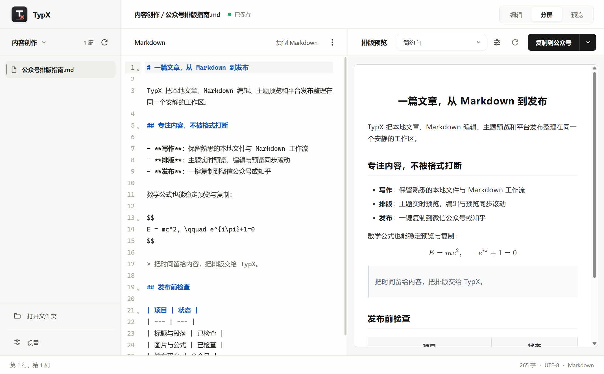
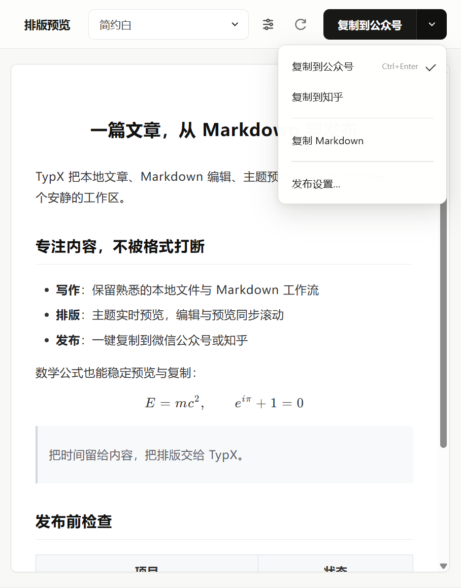

  

<h1 align="center">TypX</h1>

  为微信公众号与知乎写作者打造的本地 Markdown 排版工具

  <a href="https://github.com/LuckyZ10/TypX/releases/latest"><strong>下载最新版本</strong></a>
  &nbsp;·&nbsp;
  <a href="#快速开始">快速开始</a>
  &nbsp;·&nbsp;
  <a href="https://github.com/LuckyZ10/TypX/issues">问题反馈</a>

  
  
  
  

---

## 一篇文章，从 Markdown 到发布

TypX 把本地文章、Markdown 编辑、主题预览和平台发布整理在同一个安静的工作区。左侧管理文章，中间专注写作，右侧实时确认最终效果。

## 核心功能

| 写作 | 排版 | 发布 |
| --- | --- | --- |
| 直接管理本地 Markdown 文件夹 | 多套内置主题与实时预览 | 一键复制到微信公众号或知乎 |
| CodeMirror 编辑器与语法提醒 | 编辑、分屏、预览三种视图 | 两个平台使用独立复制方案 |
| 自动保存状态与外部修改感知 | 图片、代码、表格与数学公式 | 可复制 Markdown 原文与文件路径 |

- **本地项目管理**：打开文件夹即可写作，自动恢复最近项目和文章。
- **公众号公式优化**：中文、`\text{}`、行内公式与长块公式均经过专门处理。
- **预览反向定位**：点击预览文字即可回到对应 Markdown 位置并高亮选中。
- **发布状态标记**：文章可标记为已发布公众号，减少重复发布。
- **自定义主题**：调整字号、文末内容和 CSS，保存为自己的排版主题。
- **自动更新**：发现新版本后可在 TypX 内下载并完成更新。

## 发布，不再反复修格式

公众号、知乎和 Markdown 共用一个清晰的发布入口。TypX 会根据目标平台处理公式、图片和样式，让编辑器里看到的效果尽可能稳定地带到发布平台。

  

针对中文技术文章，TypX 重点优化了公式中的中文字符、相邻行内公式、列表换行、块公式间距和超长公式展示。

## 本地优先，也能连接坚果云

文章始终保留在自己的本地文件夹中。需要跨设备时，可按项目连接坚果云 WebDAV；首次同步采用安全合并，同名且内容不同的文件会保留冲突副本。

  

## 快速开始

1. 前往 [TypX Releases](https://github.com/LuckyZ10/TypX/releases/latest)。
2. 下载 `TypX-Setup-x.x.x.exe`。
3. 运行安装向导并选择安装目录。
4. 打开一个存放 Markdown 的文件夹，选择文章后即可编辑和预览。
5. 在右上角选择公众号或知乎，一键复制到对应平台。

  

## v0.7.0

- 全新整理的桌面界面和操作层级
- 坚果云 WebDAV 项目同步
- 自动检查更新与手动检查入口
- Markdown 语法提醒、文件路径复制和发布状态标记
- 预览点击定位与清晰的编辑器选区高亮
- 公众号中文公式、列表换行、长公式和段落间距优化

如遇到问题或有功能建议，欢迎在 [Issues](https://github.com/LuckyZ10/TypX/issues) 中反馈。

---

把时间留给内容，把排版交给 TypX。

