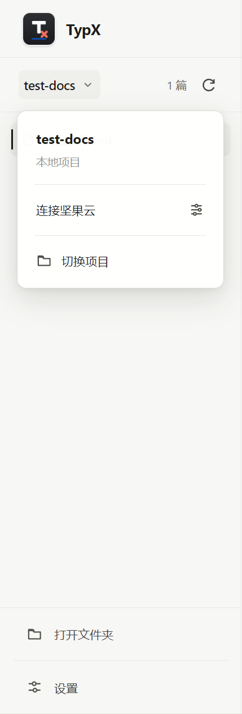
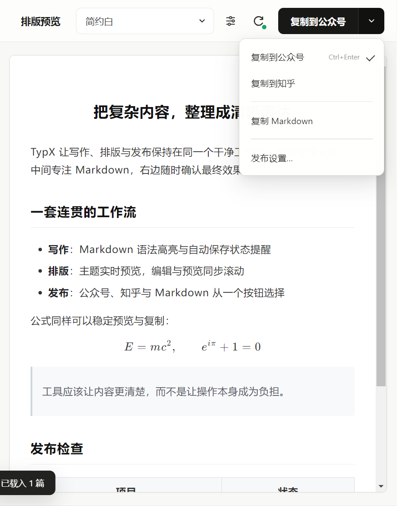

# TypX — 本地 Markdown 排版工具

**中文 | [English](README.md)**

<p>
  
</p>

**把本地文件夹里的 Markdown 文章，一键排版复制到微信公众号 / 知乎。**

Markdown Nice（mdnice）的本地文件夹版：Electron + TypeScript 编写。默认完全在本机工作，也可按项目选择连接坚果云 WebDAV。

📖 **[完整使用教程（含界面截图）](docs/使用教程.md)** ｜ ⬇️ **[下载 Windows 安装包 / 便携版](https://github.com/LuckyZ10/TypX/releases/latest)**

<br />

## 界面


左侧是项目与文章，中间是 Markdown 编辑器，右侧是实时排版预览；项目/文档/发布操作各自集中在固定区域。打开过的文件夹自动登记为**项目**，启动时恢复最近项目和上次编辑到一半的文章。

<table>
  <tr>
    <td><br /><sub><b>项目操作</b>：切换文件夹、连接坚果云</sub></td>
    <td><br /><sub><b>发布操作</b>：公众号、知乎、Markdown 共用一个入口</sub></td>
  </tr>
</table>

## 主题

7 套内置主题（简约白 / 橙心 / 蓝绿清新 / 优雅紫 / 极客黑 / 墨青标签 / 墨笺论文），支持自定义 CSS 保存为个人主题。

<table>
  <tr>
    <td><br /><sub><b>墨笺论文</b> — 衬线宋体 · 首行缩进 · 两端对齐 · 三线表</sub></td>
    <td><br /><sub><b>墨青标签</b> — 深色 H2 标签块 · 珊瑚红加粗 · 墨青蓝斜体</sub></td>
  </tr>
  <tr>
    <td><br /><sub><b>简约白</b> — 黑白极简 · 通用</sub></td>
    <td><br /><sub><b>极客黑</b> — 深色代码风 · 程序员向</sub></td>
  </tr>
</table>

## 核心特性

**✍️ 写作**

- **项目系统**：文件夹自动登记为项目，多项目切换，自动恢复上次文章（外部修改自动重载）
- **坚果云同步（可选）**：按项目连接 WebDAV，可手动或保存后自动同步；密码由系统安全存储加密，双端同时修改时保留冲突副本
- **三栏界面**：文件树右键可用系统默认程序打开/在资源管理器定位/标记「已发布公众号」（绿色徽章 + 统计，防止重复上传）；文件树 · CodeMirror 6 编辑器（Ctrl+S 保存）· 同步滚动预览
- **视图模式**：编辑 / 分屏 / 预览三档切换，「预览」隐藏 Markdown 原文整屏读排版

**🎨 排版**

- **7 套主题 + 自定义 CSS**：普通网页写法即可，复制时逐元素内联成 `style` 属性（mdnice 同款原理），粘贴后样式不丢
- **数学公式**：KaTeX 预览（`$...$` / `$$...$$`），复制转行内 SVG——微信唯一稳定的公式方案，几百个公式的长文也能稳定粘贴
- **斜体图注**：图片单独成段 + 下一行整段斜体，自动变蓝色居中图注
- **文末推荐**：按平台配置的 Markdown 链接（如公众号合集），复制时自动加分割线追加

**📤 双平台复制管线**

「复制到公众号」与「复制到知乎」是两条**独立配置**的管线——公式、图片策略分别设置互不牵制，一边调优不影响另一边：

| | 公众号（已验证方案） | 知乎（独立起步方案） |
| --- | --- | --- |
| 公式 | 转行内 SVG | 原样 HTML |
| 图片 | base64 直贴 / 可选图床 | base64 直贴 |
| 文末 | 自定义推荐链接 | 自定义推荐链接 |

- **图床支持**（可选）：Gitee / GitHub / SM.MS，一键测试，内容哈希命名 + 本地缓存，同图不重复上传

右上角采用一个带下拉菜单的主复制按钮：直接点击执行上次选择的平台，下拉菜单可切换公众号、知乎或复制 Markdown，不再重复摆放多个平台按钮。

## 快速开始

**Windows 安装包（推荐）**：[Releases](https://github.com/LuckyZ10/TypX/releases/latest) 下载 `TypX-Setup-x.x.x.exe`，通过安装向导选择目录并安装。从 **0.6.2** 起，手动安装这一次后，后续版本可在 TypX「设置」中自动检查、下载并覆盖原安装目录。

**免安装便携版**：下载 portable zip，解压运行 `TypX.exe`，删除文件夹即卸载。

**源码运行**：

```bash
npm install
npm run dev        # 构建并启动
```

> 国内网络 Electron 下载失败时：`ELECTRON_MIRROR=https://npmmirror.com/mirrors/electron/ npm install`

更多命令与打包：`npm run typecheck` / `npm run build` / `npm run dist`（安装包）/ `npm run dist:dir`（便携版），详见[使用教程](docs/使用教程.md)。

## 已知平台限制

- 公众号会过滤粘贴内容里的 base64 图片与公式 HTML——这正是公式转 SVG、图片可选图床的原因
- 衬线字体主题在手机端回退为系统宋体，观感基本保留

## 协议

本项目采用 [PolyForm Noncommercial 1.0.0](LICENSE) 协议：**个人学习、研究与非商业用途免费使用与修改；未经授权，禁止商业使用**（如需商业授权请联系作者）。

## 致谢

本项目站在前人的肩膀上：

- 排版思路与公众号适配经验来自 [mdnice（Markdown Nice）](https://mdnice.com) 与 [doocs/md](https://github.com/doocs/md)，尤其是[《和微信公众号编辑器战斗的日子》](https://product.mdnice.com/article/intro/battle-with-wechat/)中「公众号接受无 defs SVG 公式」等关键结论
- 「墨青标签 / 墨笺论文」主题设计源自 Typlatex Article Ink 排版样式
- 构建 [Electron](https://www.electronjs.org) · [esbuild](https://esbuild.github.io) · [CodeMirror 6](https://codemirror.net) · [marked](https://marked.js.org) · [KaTeX](https://katex.org) · [MathJax](https://www.mathjax.org) · [highlight.js](https://highlightjs.org) · [DOMPurify](https://github.com/cure53/DOMPurify)，感谢以上开源项目
